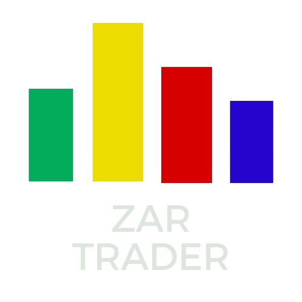

# ZAR Trader

## Introduction
Welcome to ZAR Trader, a web application designed for stock trading enthusiasts. ZAR Trader provides users with a platform to buy and sell stocks, track their investment portfolios, and stay updated with real-time stock market data. It does not use real currency. It uses virtual currency.

**Author:** Liam-York Robertson

## The Inspiration Behind the Project
The idea for ZAR Trader stemmed from the desire to create a user-friendly platform for individuals interested in stock trading. Inspired by the complexity of stock market applications and the need for a simpler, more intuitive solution, ZAR Trader aims to provide users with a seamless trading experience to practice investing and get their foot in the door.

## Deployment
ZAR Trader is currently deployed at

## Installation
To run ZAR Trader locally, follow these steps:

1. Clone the repository: `git clone https://github.com/yourusername/ZAR-Trader.git`
2. Navigate to the project directory: `cd ZAR-Trader`
3. Install dependencies: `npm install`
4. Start the application: `npm start`
5. Visit `http://localhost:3000` in your web browser to access ZAR Trader.

## Usage
ZAR Trader allows users to:

- Register and create a trading account.
- Buy and sell stocks from a variety of exchanges.
- View real-time stock market data and track their investment portfolios.
- Analyze stock performance using charts and historical data.

## Contributing
Contributions to ZAR Trader are welcome! To contribute:

1. Fork the repository.
2. Create a new branch: `git checkout -b feature/new-feature`
3. Make your changes and commit: `git commit -m "Add new feature"`
4. Push to the branch: `git push origin feature/new-feature`
5. Open a pull request.

## Related Projects
Explore these related projects:

- [Ticker](https://github.com/achannarasappa/ticker) - Terminal stock watcher and stock position tracker.
- [Open Trading Platform](https://github.com/ettec/open-trading-platform) - An open source highly scaleable platform for building cross asset execution orientated trading applications that can be easily deployed on-prem or in the cloud.

## Technical Challenges and Solutions
### Frontend and Backend Technologies
- **Frontend:** ZAR Trader utilizes HTML, CSS and Javascript for the frontend, providing a dynamic and interactive user interface.
- **Backend:** Powered by Node.js and Express.js, ZAR Trader's backend handles authentication, data processing, and communication with external APIs.
- **Real-time Data:** Integrating with financial APIs posed challenges in handling real-time stock market data and ensuring data accuracy.
- **User Authentication:** Implementing secure user authentication and authorization mechanisms to protect user data and transactions.

### Struggles and Learning Moments
Throughout the development of ZAR Trader, several challenges were encountered:

- **Data Integration:** Fetching and processing real-time stock market data from external APIs required careful planning and error handling.
- **User Experience:** Balancing functionality with simplicity was a continuous challenge, as the application aimed to cater to both novice and experienced traders.
- **Testing and Debugging:** Ensuring the reliability and stability of the application required thorough testing and debugging, especially in handling edge cases and unexpected user inputs.

## Licensing
ZAR Trader is licensed under the [MIT License](LICENSE).
